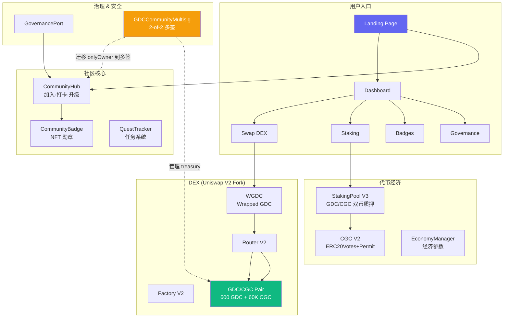

# 🏛️ GDC Autonomous Community

> GoodChain 上第一个自包含 DeFi 社区生态——DEX、代币、质押、NFT 勋章、治理一体化。

[](https://goodchainscan.org)
[](./LICENSE)
[](https://goodchainscan.org)
[](https://xxf777lu-cell.github.io/goodchain-community/)

[**🌐 GitHub Pages →**](https://xxf777lu-cell.github.io/goodchain-community/)

## 🚀 社区前端入口

> 在线 DApp：Swap 交易 · Staking 质押 · NFT 勋章 · 经济仪表盘 · 治理

| 平台 | 入口 | 状态 |
|------|------|:----:|
| **GitHub Pages** | [xxf777lu-cell.github.io/goodchain-community](https://xxf777lu-cell.github.io/goodchain-community/) | 🟢 在线 |

### 📑 功能页面

| 🏠 首页 | 📊 Dashboard | 🔄 Swap | 💰 Staking | 🏅 Badges | 📈 经济面板 | 🗳️ 治理 | 📢 公告 |
|:---:|:---:|:---:|:---:|:---:|:---:|:---:|:---:|
| 社区入口 | 资产概览 | GDC↔CGC | 双币质押 | NFT勋章 | 实时价格 | 社区治理 | 合约总览 |

---

## 📐 架构



## 🗺️ 合约清单

| # | 合约 | 地址 | Explorer | 验证 |
|---|------|------|----------|:----:|
| 1 | CommunityHub | `0x05C275...A34a7C` | [🔗](https://goodchainscan.org/address/0x05C27594c5624B8a87483c4C83D5F18aF5A34a7C) | ✅ |
| 2 | CommunityBadge | `0x605d74c...27Aba` | [🔗](https://goodchainscan.org/address/0x605d74c166d242064a47A1290cC86B01a0d27Aba) | ✅ |
| 3 | CGC Token V2 | `0x872Bd3...197B4` | [🔗](https://goodchainscan.org/address/0x872Bd32ebCAE015656c40ae373AD3a5603f197B4) | ✅ |
| 4 | QuestTracker | `0x464A0B...5330` | [🔗](https://goodchainscan.org/address/0x464A0Bb39bfE59A1742d610124c4E211b4225330) | ✅ |
| 5 | EconomyManager | `0x555602...4Fd8` | [🔗](https://goodchainscan.org/address/0x555602C6aDdC64ebb02fa6B03908272CA93b4Fd8) | ✅ |
| 6 | GovernancePort | `0xe410e4...af38` | [🔗](https://goodchainscan.org/address/0xe410e4B2181eD4CAe659f6b0dF80CCa680D0af38) | ✅ |
| 7 | StakingPool V3 | `0xf8179e...E94E` | [🔗](https://goodchainscan.org/address/0xf8179e6429fB8192989B2867Cd125772fb5fE94E) | ⏳ |
| 8 | WGDC | `0x1C7cA2...e348` | [🔗](https://goodchainscan.org/address/0x1C7cA2F2a0dE1FFCcE397B539aCDA16E054ae348) | — |
| 9 | Factory V2 | `0x71840c...b4cd` | [🔗](https://goodchainscan.org/address/0x71840c840494d3c79b77f0802fdad52b4dedb4cd) | — |
| 10 | Router V2 | `0x971a17...a37e` | [🔗](https://goodchainscan.org/address/0x971a1734c467dea818300d4b0cd838413a4aa37e) | — |
| 11 | GDC/CGC Pair | `0x0E7073...1BC1B` | [🔗](https://goodchainscan.org/address/0x0E70731Ca9D7BAaeE9E88c5FE8b87f819195BC1B) | — |
| 12 | Multisig V4 | `0xa44691...23F` | [🔗](https://goodchainscan.org/address/0xa44691d6Aa5e02fC8F7f4f763CE327baA7f7E23F) | ⏳ |

> DEX 合约（#8-11）基于 Uniswap V2 npm 预编译字节码部署，源码与链上 bytecode 不匹配，无法通过浏览器验证——但功能完整可用。

## 💰 代币经济

### CGC — Community Governance Coin

| 参数 | 值 |
|------|-----|
| 标准 | ERC20 + Votes + Permit + Vesting + Anti-whale |
| 总供应 | 100,000,000 CGC（软上限） |
| 持币上限 | 1%（Anti-whale） |
| 分配 | 40M 社区 · 30M 生态 · 20M 团队（vesting）· 10M 流动性 |

### Staking — 双币质押

| 参数 | GDC 池 | CGC 池 |
|------|--------|--------|
| 年化奖励率 | 12% | 25% |
| 锁仓 | 7 天 | 7 天 |
| 奖励来源 | 无（GDC 是原生币） | 奖励池（675 CGC） |

### DEX — 流动性池

| 指标 | 值 |
|------|-----|
| 池子 | GDC / CGC |
| 储备金 | 600 GDC / 60,000 CGC |
| 单价 | 1 CGC = 0.01 GDC |
| 全稀释估值 | ~1,000,000 GDC |

## 🚀 快速开始

### 连接 GoodChain

```
Network Name: GoodChain
RPC URL:      https://rpc1.goodchainscan.org
Chain ID:     219 (0xDB)
Currency:     GDC
Explorer:     https://goodchainscan.org
```

### 体验生态

1. **连接钱包** → 在 Metamask 添加 GoodChain 自定义网络
2. **加入社区** → Join → 获得初始 CGC 空投 + 居民身份
3. **每日打卡** → CheckIn → 赚积分、升等级、自动铸造勋章
4. **交易 CGC** → Swap 页面 GDC ↔ CGC
5. **质押挖矿** → Staking 页面质押 CGC（25% APR）或 GDC（12% APR）
6. **查看勋章** → Badges 页面查看已获得的 NFT 勋章

## 🛠️ 技术栈

| 层 | 技术 |
|----|------|
| 合约 | Solidity ^0.8.11 (Paris EVM) · OpenZeppelin 5.0.2 |
| DEX | Uniswap V2 Fork (npm pre-compiled) |
| 前端 | React 19 · Vite 8 · TypeScript · zustand · ethers v6 |
| 链 | GoodChain #219 · 原生币 GDC · 5 gwei gas |

## 🔐 治理与安全

- **多签钱包**：`GDCCommunityMultisig` 2-of-2 签名（`0xa44691...23F`），支持运行时 add/remove owner 和 changeThreshold
- **合约 owner 迁移中**：当前合约 `onlyOwner` 指向部署者 EOA，逐步迁移到多签
- **Badge Minter Bot**：离链服务，监听 Hub 事件自动调用 Badge.mintBatch()
- **已知限制**：GoodChain 无 EIP-1559（所有交易需 Legacy type 0），无 PUSH0 支持（Solidity 需 ≤0.8.11）

## 📂 项目结构

```
goodchain-community/
├── contracts/              # Solidity 合约
│   ├── contracts/          # .sol 源码
│   ├── scripts/            # 部署/审计/救援脚本（11 个活跃）
│   │   └── _archive/       # 93 个历史脚本归档
│   └── artifacts/          # 编译产物
├── frontend/               # React SPA
│   └── src/
│       ├── pages/          # 9 个路由页面
│       ├── components/     # 可复用组件
│       ├── contracts.ts    # 合约地址 + ABI 统一管理
│       └── store.ts        # zustand 全局状态
├── ms-deploy/              # 多签合约部署工具
│   ├── contracts/          # GDCCommunityMultisig.sol
│   └── _archive/           # 历史调试脚本
└── ECOSYSTEM.md            # 完整生态清单
```

## 📜 License

MIT
